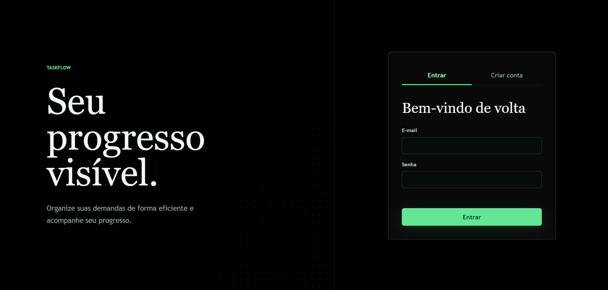

# Taskflow

API de gerenciamento de tarefas com FastAPI, PostgreSQL, autenticação JWT,
migrations Alembic, testes automatizados e uma interface web responsiva.

## Screenshots





## Caso de uso

Uma pessoa cria uma conta, entra em seu espaço privado e organiza tarefas. Ela
pode criar, editar, concluir, filtrar e excluir itens. Cada tarefa pertence a um
usuário, e a API impede leitura ou alteração por outra conta.

## Subir do zero

### Requisitos

- Docker Desktop com Docker Compose
- Portas `8000` e `5434` livres

Na raiz do projeto, execute:

```powershell
docker compose up --build
```

Não é necessário criar um arquivo `.env` para executar localmente. O
`compose.yaml` já define as URLs e credenciais dos bancos e fornece valores
padrão de desenvolvimento para `JWT_SECRET_KEY` e
`ACCESS_TOKEN_EXPIRE_MINUTES`. O arquivo `.env.example` serve como modelo para
sobrescrever esses valores quando necessário; ele não é carregado diretamente.

Esse único comando:

1. cria os bancos PostgreSQL de aplicação e testes;
2. aplica `alembic upgrade head` no banco de testes;
3. executa a suíte automatizada;
4. aplica as migrations no banco da aplicação;
5. inicia a API somente se os testes passarem.

Depois, acesse:

- Interface: http://127.0.0.1:8000
- Swagger: http://127.0.0.1:8000/docs
- Health check: http://127.0.0.1:8000/health

Para encerrar, pressione `Ctrl+C`. Os dados ficam no volume Docker. Para
recomeçar com bancos vazios:

```powershell
docker compose down -v
docker compose up --build
```

> Os valores padrão existem apenas para facilitar o desenvolvimento local. Para
> usar uma chave JWT própria, copie `.env.example` para `.env` e altere
> `JWT_SECRET_KEY`. Em produção, não utilize as credenciais ou a chave padrão do
> Compose.

## Roteiro de demonstração

1. Abra http://127.0.0.1:8000 e crie uma conta.
2. Crie tarefas e marque uma delas como concluída.
3. Use os filtros `Em andamento` e `Concluídos`.
4. Edite e exclua uma tarefa.
5. Saia, crie outra conta e confirme que as tarefas anteriores não aparecem.
6. Abra `/docs`, autentique em `POST /auth/login` e teste as mesmas operações.

No Swagger, o login usa formulário OAuth2: informe o e-mail no campo `username`.

## Endpoints

| Método | Rota | JWT | Descrição |
| --- | --- | --- | --- |
| GET | `/health` | Não | Verifica API e banco |
| POST | `/auth/register` | Não | Cria uma conta |
| POST | `/auth/login` | Não | Retorna token JWT |
| GET | `/auth/me` | Sim | Retorna a conta autenticada |
| GET | `/tasks` | Sim | Lista e filtra tarefas próprias |
| POST | `/tasks` | Sim | Cria uma tarefa |
| GET | `/tasks/{id}` | Sim | Consulta uma tarefa própria |
| PATCH | `/tasks/{id}` | Sim | Edita ou conclui uma tarefa |
| DELETE | `/tasks/{id}` | Sim | Exclui uma tarefa |

## Migrations e testes

Com os containers ativos, aplicar todas as migrations:

```powershell
docker compose exec api alembic upgrade head
```

Executar novamente os testes em um container descartável:

```powershell
docker compose run --build --rm test
```

Criar uma migration depois de alterar os modelos:

```powershell
docker compose exec api alembic revision --autogenerate -m "descrição"
docker compose exec api alembic upgrade head
```

O schema é criado exclusivamente por migrations versionadas. A aplicação não
usa `Base.metadata.create_all`.

## Arquitetura

```text
app/
|-- core/          # configuração e segurança JWT/Argon2
|-- database/      # engine e sessões SQLAlchemy assíncronas
|-- models/        # tabelas User e Task
|-- routes/        # camada HTTP
|-- schemas/       # contratos Pydantic
|-- services/      # regras de negocio e persistencia
`-- static/        # interface que consome a API
migrations/        # histórico Alembic versionado
tests/             # testes HTTP e de autorização
```

Relação principal: um `User` possui muitas `Task`; a chave estrangeira
`tasks.owner_id` garante esse vínculo no PostgreSQL.

## Critérios de aceite

- [x] A API sobe do zero seguindo somente este README.
- [x] Autenticação JWT protege as rotas de tarefas e perfil.
- [x] As migrations rodam com `alembic upgrade head`.
- [x] Existem testes automatizados de cadastro, criação, edição e exclusão.
- [x] As camadas `route`, `service` e `model` estão separadas.

